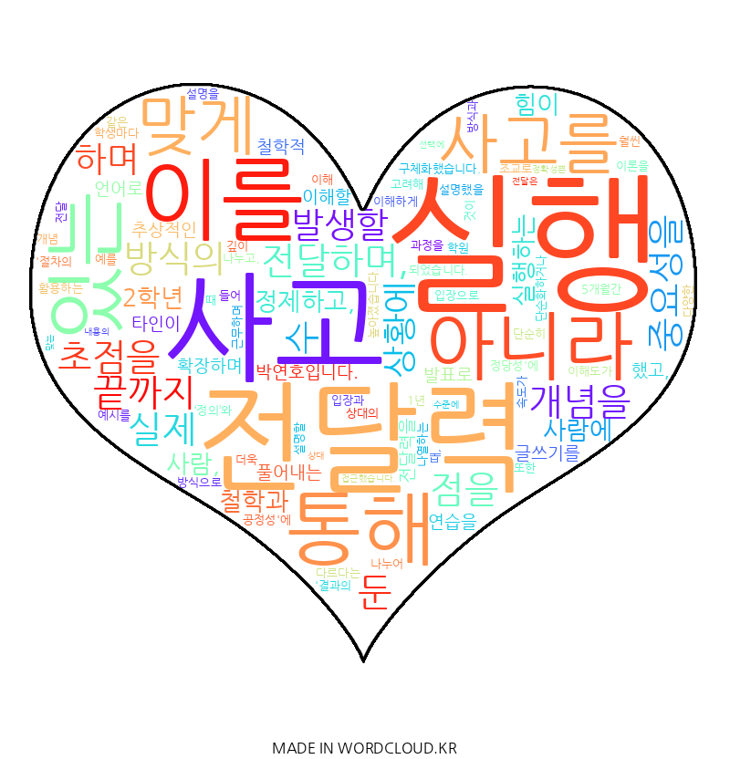

# 철학과 2학년 박연호를 소개합니다.
## 간단 소개
- 사고를 정제하고, 사람에 맞게 전달하며, 실행력을 바탕으로 문제를 탐구하는 사람

## 관심 분야
- AI 판단 기준과 윤리 이론의 관계

## 문제의식
인간은 삶에서 어떤 윤리적 기준(공리주의, 의무론, 덕윤리)을 전제하느냐에 따라 동일한 상황에서도 전혀 다른 판단을 내립니다.
AI도 마찬가지로 어떤 윤리적 기준을 적용하느냐에 따라 전혀 다른 평가를 받습니다.
이에 따라 저는 다음과 같은 질문들을 중심으로 문제의식을 잡았습니다.
- AI는 어떤 윤리적 기준을 바탕으로 판단하고 판단 받아야 하는가?
- 서로 다른 윤리 이론이 충돌할 때, 그 우선순위는 어떻게 설정되어야 하는가?

## 희망 탐구 방향
- 상이한 윤리 이론들로 AI 판단 후 이론의 우선순위 설정

## 나의 강점
- 복잡한 개념을 구조화하여 쉽게 전달하는 능력
- 아이디어를 단지 실천할 뿐 아니라 상황에 맞게 조정하는 유연성

## 경험
- **학원 조교 및 강사**
  - 학생의 이해 수준에 맞춘 설명 방식 - 비유와 예시를 통한 설명 방식의 다양화
- **학생회 활동**
  - MT 및 신입생 환영회 기획 및 진행하며 상황에 따라 프로그램 수정
 
특히 다양한 대상과 상황 속에서 동일한 내용을 다르게 설명했던 경험을 통해 개념 전달을 고정적으로 할 것이 아닌 맥락 속에서 구성해야 한다는 것을 체감했습니다. 이는 AI의 윤리적 판단 기준을 설계하는 데에도 중요한 도움이 될 것이라고 생각합니다.

## 목표
- 기술과 윤리 사이 판단 기준의 설계자
- AI를 단순한 도구가 아닌, 인간 삶을 위해 연구하는 사람

